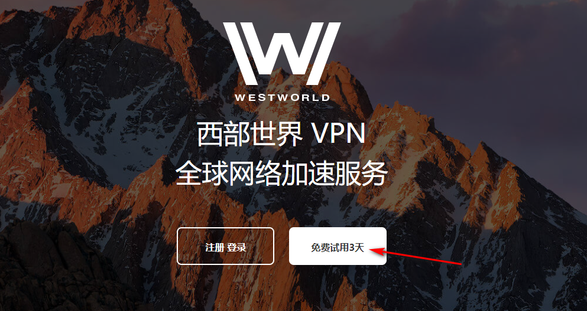
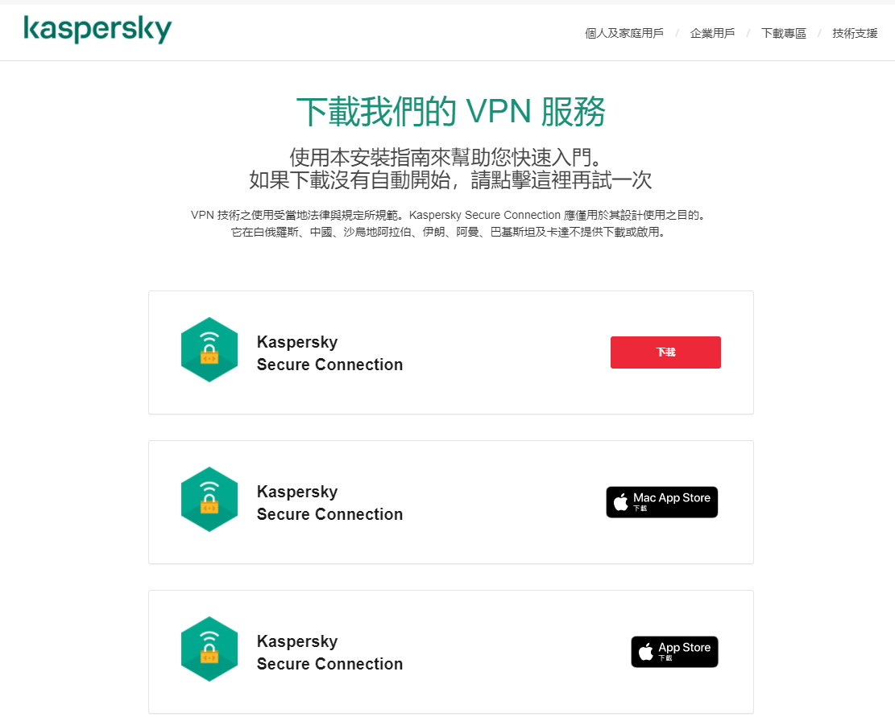

# 最新排名前TOP3好用稳定的梯子推荐，手机电脑双平台通用，秒开4K超高清视频
世界top3电脑梯子,世界排名前三手机梯子,永久免费的梯子,免费梯子软件推荐,稳定的梯子软件,分享个梯子软件,推荐个好用的梯子,电脑挂梯子上外网,翻墙教程,好用的梯子推荐,科学上网工具分享

### Hello，这是晴天测评频道，今天给大家推荐三个世界排名Top3稳定且好用的电脑梯子工具，当然这三个梯子软件在手机上也是可以用的。在推荐之前，我本人也是经过比较长时间的使用和体验，深挖了他们的背景和运营时间，以下排名是根据我个人喜好进行的排序，具有主观性，大家可以作为参考，排名第一的也是我自己目前正在使用的稳定电脑梯子软件，有免费ssr节点和免费V2ray节点以及免费的Trojan节点。

## 一、Westworld 梯子

### 官网地址：https://xbsj4621.fun/i/th063
### 运营时间：3年以上
### 推荐指数：⭐⭐⭐⭐⭐

这个梯子名字也叫西部世界，是我自己本人用的比较久的一款**免费电脑梯子**，当然它原本的设计初衷并不是免费的，后台有付费节点也有免费节点，我是通过一些特定的方法，长期白嫖了他们的免费节点，不得不说，这种收费和免费相结合的梯子软件，白嫖起来是真的香。

为什么？

因为如果是完全**免费的电脑或者手机梯子**，那等于是纯公益的，运营商要购买各类服务器搭建机场线路，如果进行纯免费公益机场运营，那么他们拿什么覆盖成本，羊毛出在羊身上，这个道理大家应该深有体会。

所以纯免费的梯子软件，要么就是各类广告弹窗很多，要么就是有什么特殊方法产生收益，总而言之，使用体验和安全性不尽人意。

但是像这类付费和免费结合的机场梯子软件，就让人比较放心，一方面他们有付费节点可以产生收益，用来覆盖机场线路等成本，另一方面，放出**免费的ssr节点**或者**免费的V2ray节点**吸引用户使用，这类免费节点线路肯定是会长期维护的，而且一般来说速度会很不错，不然怎么培养用户习惯让他们进行付费。

西部世界这款梯子就是付费免费相结合，而且ios-windows-mac-安卓都有独立的客户端可以下载，看4K超高清视频是一点压力都没有，速度是真的快，而且网络也是真的稳定。

西部世界针对新注册用户会有三天免费试用的时长，并且在这段时间当中，是不限流量的，注册是采用邮箱注册的形式，他们的逻辑矛盾点就在这里。

大家可以直接去谷歌搜索“临时邮箱”，这类网站一搜一大把，而且都是免费的，用临时邮箱去注册账号，这样就能获得三天的免费试用时间，等三天到期之后，再去注册一个账号，无限循环，就可以了。

目前这个bug经过测试还能用。

虽然我后来为了看奈飞开通了西部世界的付费节点，但是他们的免费节点，真的比大部分付费机场速度都要快都要稳定，这也是我把它排在第一位的原因，这个免费的梯子软件，用起来是真的很不错。

## 二、卡巴斯基

### 官网地址：https://www.kaspersky.com.tw/updates/home-security/secure-connection
### 运营时间：3年以上
### 推荐指数：⭐⭐⭐⭐

没错，卡巴斯基，就是我们熟悉的那款杀毒软件，我也是后来才知道，他们居然也出了一款[免费的梯子软件](https://github.com/gelangtai/TopVPN/)，我用了一段时间，感觉还可以，虽然人家不是专业做梯子VPN的，但架不住人家公司大啊，下场玩票确实能吊打很多脚本小子。

卡巴斯基出品的免费梯子，稳定性还是很不错的，人家这么大一个公司，做出来的东西再差下限也不会低，不过这个梯子有一个缺点，就是想要下载的话，必须先开代理，也就是说，你得先有一个梯子，然后才能下载他们的梯子软件。

客户端还是蛮清爽的，只要点击软件中间的绿色按钮，就能够自动连接，并且每天都有200M的免费流量额度可以用，如果是用来上上网查查资料是绝对够用了。或者你也可以像我一样，把这个免费梯子软件加入到备用梯子列表当中，以备不时之需。

总体来说，卡巴斯基出品的梯子软件，各方面稳定性都是不错的。

## 三、Pushme

### 官网地址：https://hide.me/en/
### 运营时间：2年以上
### 推荐指数：⭐⭐⭐

这款免费的梯子软件是我之前测评过程当中无意发现的，既然能推荐给大家，说明速度和稳定性还是不错的，虽然和上面两款相比，我个人感觉略有逊色，他每个月有10GB的流量使用额度，这个流量，对于偶尔刷视频的用户来说应该也够用了。

这款梯子软件的缺点是，有时候会莫名其妙出现弹窗，不过并不是广告弹窗，而是客户端自己某种使用协议的弹窗，因为是英文的，具体我也看不懂，而且经常是关掉之后过段时间又自动弹出，也不知道从哪里可以永久关闭，这是很糟心的一点。

至于使用速度而言，观看1080P的视频亲测是没有问题的，在免费梯子当中，能做到这一点，已经很不容易了。

注意下，以上三款免费[电脑梯子](https://www.dazhuanlan.com/yuluoqingtian/topics/2635282)软件，都不支持观看奈飞，西部世界除外，西部世界的免费节点不支持观看奈飞，但是付费节点是支持的。

### 这三款梯子，就是在我眼里排名前三的稳定好用而且还永久免费的梯子软件，如果你要进行科学上网，需要一款翻墙工具，那么这三款梯子都值得尝试一下。
